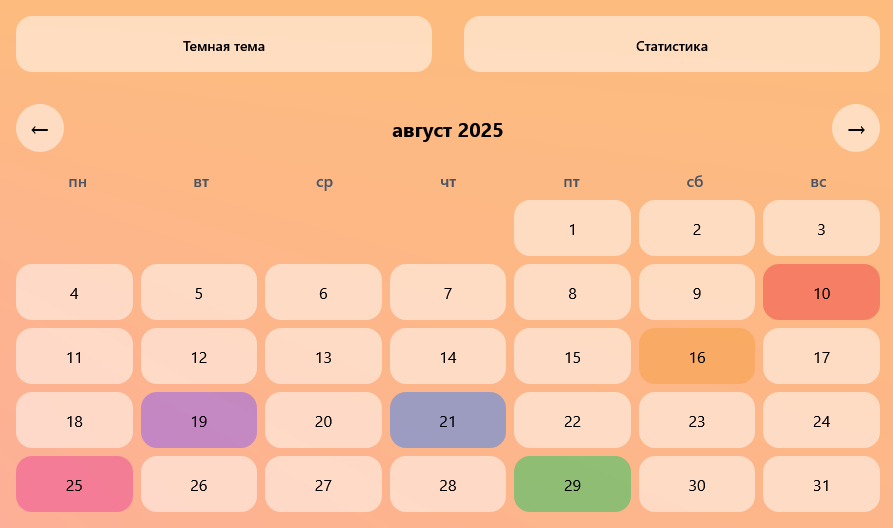
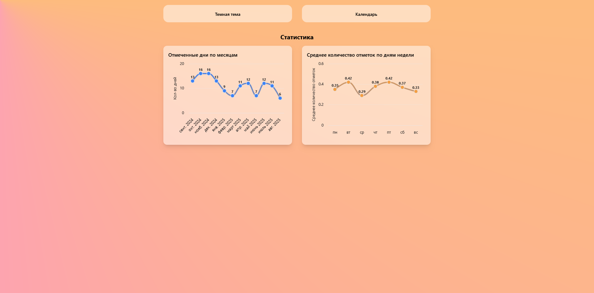
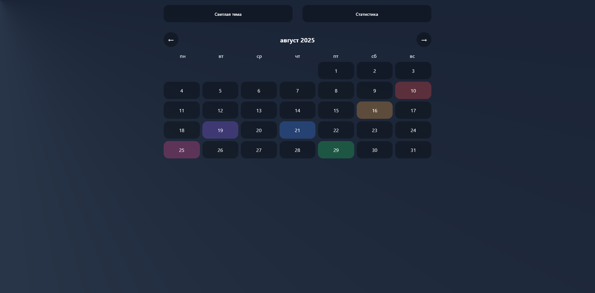
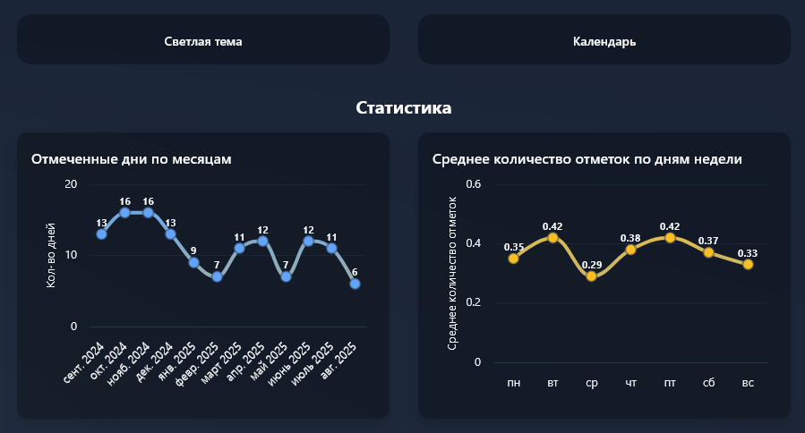

# 📅 WebCalendar

Интерактивный календарь с цветными отметками, сменой тем и статистикой.  
Приложение работает прямо в браузере и развернуто на **GitHub Pages**.

🔗 [Попробовать приложение](https://dobriytauren.github.io/WebCalendar)

---

## ✨ Возможности 

- 🖌️ Цветные отметки на днях  
- 🌗 Переключение светлой и тёмной темы  
- 📊 Статистика по отмеченным дням  
- 💾 Сохранение данных в браузере  
- 🚀 Доступен без установки (работает прямо в браузере)  

---

## 📸 Скриншоты

### Светлая тема
 

### Тёмная тема
 

---

## 🛠️ Технологии

- Blazor WebAssembly 
- Tailwind CSS 
- LocalStorage
